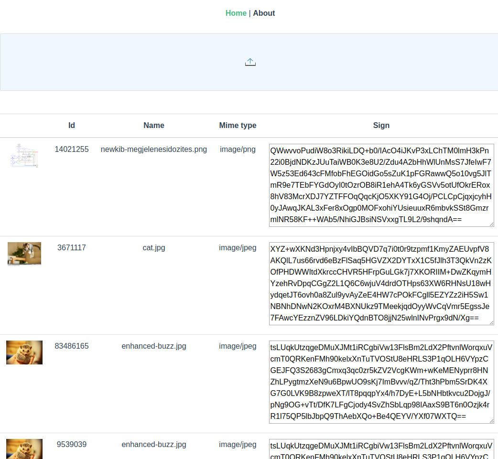

Feladat
=======
Valósítsd meg a webböngészőn keresztül feltöltött képek tárolását és digitális aláírását.
A rendszer JavaScript frontend-del és Java Spring Boot backend-del rendelkezik, melyek közül a fájl feltöltés kerete már implementálásra került.
(Amennyiben otthonosabban mozogsz JavaEE környezetben, a feladatot megoldhatod annak használatával is, ez esetben magadnak kell létrehozni a projektet.)
A tárolás és aláírás megoldása viszont már a Te feladatod.
Az aláíráshoz használandó kulcsot a projekt könyvtárában, PKCS8 formátumban találod.
Az aláírás SHA256withRSA algoritmussal legyen megvalósítva, majd ennek eredménye BASE64 algoritmus használatával legyen kódolva.
Az így kapott eredmény legyen megjelenítve a frontend-den is.
A feltöltött képek maximális mérete 2MB lehet, típusára vonatkozólag nincs megkötés.

Fontos, hogy a későbbiekben legyen lehetőség az alkalmazás továbbfejlesztésére, valamint a kód legyen érthető más fejlesztők számára is.
Az adatbázistól / adattárolástól eltekintve production ready projektet szeretnénk kapni.
(Saját kód legyen dokumentálva, tesztelve, megfelelő hibakezeléssel legyen ellátva, tartalmazzon logolást, legyen konfigurálható, illetve az alkalmazás futtatható kell legyen Linux és Windows szervereken is.)

Fejlesztési tudnivalók
======================
Az alkamazás Spring Boot keretrendszeren alapszik és `mvn spring-boot:run` paranccsal vagy a Main fájl futtatásával lehet indítani. 
Sikeres build-et követően a http://localhost:8080 url-en érhető el a fájlfeltöltő komponens és a listázó, mely kezdeti állapotban üres.
Fálj felöltés drag&drop használatával vagy kattintással és fájl kiválasztással lehetséges.

Új fájl feltöltése a "New upload" gomb megnyomása után lehetséges.

A feladat elvégézéséhez biztosított fájlok melyek a projektben megtalálhatók:
    * PKCS8 aláíró kulcs
    * Néhány teszt fájl és a hozzájuk tartozó BASE64 kódolt aláírás
	
Kiegészítések
=============
 - A képek listázásához és fájlfeltöltéshez szükséges implementálni a klienst kiszolgáló végpontokat.
 - A frontend kódon nem szükséges módosításokat végezni. 
 
Az alábbi képen egy példát kívánunk mutatni a helyes megoldásra vonatkozólag:
 
